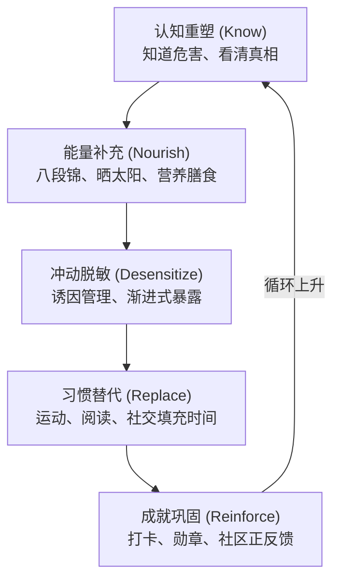

# 《Reborn》戒色康复 APP 完整产品方案规划文档

| 项目 | 内容 |
| --- | --- |
| 版本 | V1.0 |
| 日期 | 2026 年 7 月 29 日 |
| 文档性质 | 产品规划方案 |
| 状态 | 草案，待评审 |

> **说明**：本目录存放《Reborn》产品的规划文档，与 StellarYield 主代码库（Stellar DeFi 面板与金库）在工程上相互独立，仅作为文档托管。

---

## 目录

1. [项目概述](#一项目概述)
2. [市场背景与机会分析](#二市场背景与机会分析)
3. [竞品深度调研](#三竞品深度调研)
4. [产品定位与核心逻辑](#四产品定位与核心逻辑)
5. [核心模块设计](#五核心模块设计)
6. [辅助功能模块](#六辅助功能模块)
7. [UI/UX 设计方案](#七uiux-设计方案)
8. [技术架构与开发计划](#八技术架构与开发计划)
9. [运营、推广与变现策略](#九运营推广与变现策略)
10. [风险评估与应对](#十风险评估与应对)
11. [附录：竞品对比表](#十一附录竞品对比总表)

---

## 一、项目概述

### 1.1 产品名称

**Reborn（重生）** —— 寓意用户通过系统性康复，获得身体、心理、精神的全面重生。

### 1.2 一句话定位

> "不是让你'忍住'，而是让你'不想'——基于科学、医学、心理学与传统养生智慧的系统性成瘾康复平台。"

### 1.3 核心差异化

市面上 99% 的戒色 APP 只做一件事：**拦截和监控**。

Reborn 做的是**系统性康复**——从认知重塑、能量提升到习惯替代，帮助用户从根本上降低冲动频率，而非单纯依靠意志力硬扛。

### 1.4 目标用户

| 用户层级 | 画像 | 特征 |
| --- | --- | --- |
| 核心用户 | 18–35 岁男性 | 有色情/手淫成瘾困扰，渴望改变但反复失败 |
| 扩展用户 | 伴侣关系困扰者、备孕男性、自我提升者 | 追求更高精力水平 |
| 宗教用户 | 基督教、伊斯兰教、佛教等信徒 | 有戒律要求，高付费意愿群体 |

---

## 二、市场背景与机会分析

### 2.1 市场规模

- **全球自我关怀 APP 市场**：2026 年约 423 亿美元，预计 2035 年突破 2006 亿美元（CAGR 18.7%）
- **冥想管理 APP 市场**：2026 年 27 亿美元，2033 年预计达 70 亿美元（CAGR 14.7%）
- **NoFap 社区**：Reddit r/NoFap 拥有 110 万+ 成员，全球 NoFap 运动参与者数千万
- **成瘾康复 APP 细分市场**：高度分散，尚无绝对领导者，存在巨大整合机会

### 2.2 用户付费意愿

成瘾康复类 APP 的用户付费意愿远高于普通工具类 APP：

- 用户不是"想要更好的工具"，而是"**迫切需要解决方案**"
- 涉及婚姻、生育、自尊、宗教信仰等核心人生议题
- 竞品 Covenant Eyes 定价 $17–18/月仍有大量付费用户
- Brainbuddy 是收入最高的戒色 APP，拥有 10,000+ 五星评价

### 2.3 市场空白

| 空白领域 | 现有竞品缺失 | Reborn 的填补 |
| --- | --- | --- |
| 中医养生融合 | 全部西方心理学导向 | 八段锦、金刚功、站桩等传统功法 |
| 能量管理视角 | 只谈"戒"，不谈"补" | 晒太阳、泡脚、膳食调理等能量补充 |
| 冲动前干预 | 只拦截，不预防 | 诱因分析 + 冲动脱敏训练 |
| 多维度评估 | 简单 streak 计数 | 身体、心理、大脑、社交四维评估 |
| 趣味性激励 | 枯燥的打卡 | 动物头像、金币、惊喜彩蛋 |

---

## 三、竞品深度调研

### 3.1 头部竞品全景

| 竞品 | 国家 | 核心模式 | 月费 | 用户规模 | 致命缺陷 |
| --- | --- | --- | --- | --- | --- |
| Brainbuddy | 澳大利亚 | CBT 科学戒色 + 拦截器 + 社区 | $5–10 | 收入最高戒色 APP | 自导向为主，缺乏即时干预 |
| Covenant Eyes | 美国 | 问责制（截图监控发给伙伴） | $17–18 | 数十万 | 不拦截只监控，隐私感极差 |
| Remojo | 英国 | 数字排毒 + 课程 + 社区 | $4.99 | 月增 5 万注册 | 全英文，无文化本地化 |
| Fortify | 美国 | 教育视频课程 + 日记 | $3.33 | 大量教育机构 | 无拦截功能，需搭配其他工具 |
| BlockerX | 印度 | 跨平台拦截 + 社区文章 | $8 | 印度为主 | 无卸载保护，冲动即卸载 |
| BlockerPlus | 未知 | 拦截 + 卸载锁 | 免费/付费 | 10.5 万 | 功能堆砌，无科学康复体系 |

### 3.2 竞品优缺点总结

**共同优点：**

- 拦截技术成熟（黑名单/关键词/AI 图像识别）
- 社区支持降低孤独感
- 订阅模式验证可行

**共同缺点（即 Reborn 的机会）：**

- ❌ **只堵不疏**：重拦截轻康复，用户压抑后反弹更严重
- ❌ **西方中心**：全部基于 CBT/心理学，无中医养生、能量管理等东方智慧
- ❌ **枯燥乏味**：打卡、streak、日记，缺乏趣味性和成就感
- ❌ **被动应对**：等用户冲动了才干预，没有冲动前预防机制
- ❌ **单一维度**：只关注"戒"，不关注"补"和"升"

---

## 四、产品定位与核心逻辑

### 4.1 核心哲学：「疏堵结合，补升并重」

**传统戒色 APP 的逻辑：**

```
冲动来了 → 拦截/警告 → 硬扛 → 反弹
（堵而不疏，越压越弹）
```

**Reborn 的逻辑：**

```
认知重塑 → 能量提升 → 冲动自然降低
（疏堵结合，补升并重）

不是"忍住不想"，而是"充实到不想"
```

### 4.2 康复飞轮模型



### 4.3 用户旅程地图

| 阶段 | 时间 | 核心目标 | 用户行为 | APP 干预 |
| --- | --- | --- | --- | --- |
| 觉醒期 | Day 1–3 | 建立认知 | 完成测评、阅读危害科普 | 生成个性化报告，震撼性数据展示 |
| 排毒期 | Day 4–14 | 度过戒断反应 | 频繁冲动、情绪波动 | 冲动急救工具、能量提升练习 |
| 重建期 | Day 15–45 | 建立新习惯 | 开始锻炼、作息调整 | 每日任务推送、进度可视化 |
| 巩固期 | Day 46–90 | 防止 relapse | 偶尔冲动、信心波动 | AI 教练对话、社区支持 |
| 升华期 | Day 90+ | 生活方式转变 | 成瘾频率大幅降低 | 高级课程、帮助他人、终身维护 |

---

## 五、核心模块设计

### 5.1 模块一：用户初始画像与多维度分析系统

#### 5.1.1 入职测评流程（Onboarding Quiz）

**设计原则：**

- 不是"审问"，而是"诊断"
- 问题设计有科学依据，结果让用户感到"被理解"而非"被评判"
- 全程约 5–8 分钟，分步进行，避免疲劳

##### A. 基础信息层

| 问题 | 选项设计 | 数据用途 |
| --- | --- | --- |
| 年龄 | 12–17 / 18–25 / 26–35 / 36–45 / 45+ | 内容年龄适配 |
| 成瘾时长 | <1 年 / 1–3 年 / 3–5 年 / 5–10 年 / 10 年+ | 康复周期预估 |
| 频率 | 每天 / 每周 3–5 次 / 每周 1–2 次 / 每月几次 / 已减少 | 严重程度分级 |
| 首次接触年龄 | <12 岁 / 12–15 岁 / 16–18 岁 / 18 岁+ | 神经可塑性评估 |

##### B. 现状评估层（基于标准化量表）

| 维度 | 评估内容 |
| --- | --- |
| 身体症状 | 疲劳度、腰背酸痛、脱发、记忆力、专注力（1–10 自评） |
| 心理状态 | 焦虑程度、抑郁倾向、社交恐惧、自卑感（PHQ-9 简化版） |
| 关系质量 | 伴侣关系、家庭关系、社交活跃度 |
| 生活质量 | 工作/学习效率、睡眠质量、运动频率 |

##### C. 诱因分析层（最关键）

| 诱因类型 | 具体问题 | 干预策略 |
| --- | --- | --- |
| 视觉触发 | "看到什么最容易冲动？"（社交媒体/广告/街头/回忆） | 视觉管理模块 |
| 情绪触发 | "什么情绪下最容易冲动？"（无聊/焦虑/孤独/压力大/睡前） | 情绪急救工具 |
| 场景触发 | "通常在什么场景？"（床上/浴室/深夜/独处/出差） | 场景替代方案 |
| 生理触发 | "是否因生理不适而冲动？"（失眠/疲劳/荷尔蒙波动） | 体质调理方案 |

##### D. 动机与目标层

- **改变动机**：健康恢复 / 宗教信仰 / 伴侣关系 / 生育准备 / 自我提升
- **目标天数**：30 天 / 90 天 / 180 天 / 365 天 / 终身
- **过往尝试**：用过什么方法？失败原因？

#### 5.1.2 个性化报告生成

测评完成后，AI 生成《个人康复诊断报告》：

```
┌─────────────────────────────────────────┐
│  Reborn 个人康复诊断报告                 │
│  生成时间：2026年7月29日                 │
│                                         │
│  【综合评级】★★★☆☆ 中度成瘾              │
│                                         │
│  【身体维度】⚠️ 需重点关注                │
│  · 疲劳指数：7/10（高于同龄均值 40%）     │
│  · 记忆力：5/10（建议补充 DHA + 睡眠调整）│
│                                         │
│  【心理维度】⚠️ 需重点关注                │
│  · 焦虑指数：6/10（与成瘾高度相关）       │
│  · 社交回避：明显                        │
│                                         │
│  【核心诱因】🔍 识别完成                  │
│  1. 睡前无聊 + 刷手机（占比 65%）         │
│  2. 工作压力大后的"奖励"（占比 25%）      │
│  3. 周末独处时间过长（占比 10%）          │
│                                         │
│  【康复周期预估】90-120 天               │
│  【推荐方案】能量提升 + 睡前替代 + 问责伙伴│
│                                         │
│  [ 查看详细方案 > ]                      │
└─────────────────────────────────────────┘
```

#### 5.1.3 动态调整机制

- 每 7 天复评一次，调整方案
- relapse 后自动触发"复盘问卷"，分析触发因素
- 长期数据形成个人"成瘾模式图谱"

---

### 5.2 模块二：危害认知与警示教育中心

#### 5.2.1 设计原则

- **不恐吓，不贩卖焦虑** —— 用科学数据说话
- **可视化** —— 让抽象危害变得直观
- **个性化** —— 根据用户测评结果，展示"与你相关"的危害

#### 5.2.2 多维度危害科普库

##### A. 身体维度（生理层面）

| 主题 | 内容形式 | 科学依据 |
| --- | --- | --- |
| 大脑多巴胺系统 | 3D 动画：成瘾如何劫持奖赏回路 | 神经科学研究 |
| 前额叶皮层损伤 | 信息图：决策力、专注力下降机制 | fMRI 研究数据 |
| 荷尔蒙失衡 | 视频：睾酮波动、皮质醇升高 | 内分泌学研究 |
| 生殖系统影响 | 科普文：前列腺健康、精子质量 | 泌尿医学文献 |
| 体能衰退 | 对比图：成瘾者 vs 健康者体能数据 | 运动医学统计 |

##### B. 心理维度（精神层面）

| 主题 | 内容形式 | 核心信息 |
| --- | --- | --- |
| 社交焦虑 | 真实用户故事（匿名） | "我因为成瘾回避了所有社交" |
| 抑郁循环 | 交互式图表 | 成瘾→内疚→抑郁→再成瘾的恶性循环 |
| 自尊心侵蚀 | 心理测试 | "你的自我评价是多少？" |
| 注意力碎片化 | 专注力测试 | 让用户亲身体验注意力持续时间 |

##### C. 关系维度（社交层面）

| 主题 | 内容形式 |
| --- | --- |
| 亲密关系影响 | 伴侣访谈视频（动画化保护隐私） |
| 社交能力退化 | "社交能量"可视化仪表盘 |
| 职业影响 | 真实案例：因精力不济错失晋升 |

##### D. 大脑维度（神经科学）

- **多巴胺基线重置**：解释为什么"越看越刺激，现实越无聊"
- **DeltaFosB 累积**：成瘾记忆的分子机制（简化科普）
- **神经可塑性好消息**：大脑可以恢复，给用户希望

#### 5.2.3 冲动脱敏训练系统

> 不是压抑冲动，而是**降低冲动强度**。

| 训练级别 | 内容 | 原理 |
| --- | --- | --- |
| Level 1：认知重构 | 冲动来临时，打开 APP 完成 3 分钟"真相核查"（"这是真的需求还是多巴胺在骗我？"） | CBT 认知行为疗法 |
| Level 2：身体接地 | 5-4-3-2-1 感官 grounding 练习 + 冷水洗脸 | 迷走神经刺激 |
| Level 3：能量转移 | 10 个俯卧撑 / 30 秒冲刺 / 冷水澡 | 运动释放内啡肽替代多巴胺 |
| Level 4：渐进暴露 | 在受控环境下接触轻度触发（如社交媒体），练习"观看但不反应" | 暴露疗法 |
| Level 5：正念观察 | 将冲动视为 "passing cloud"，观察但不评判 | 正念减压（MBSR） |

**冲动急救按钮（Panic Button）流程：**

```
用户点击"我有冲动"
├─ 倒计时 15 秒（冷静期）
├─ 弹出"上次冲动后你感觉如何？"（唤醒理性）
├─ 提供 3 个选项：
│   1. 启动 3 分钟 grounding 练习
│   2. 呼叫 AI 教练对话
│   3. 联系问责伙伴
└─ 如果选择"我还是想做"
    └─ 启动 15 分钟延迟锁（15 分钟后才能继续）
```

#### 5.2.4 视觉管理工具

基于用户测评中的"视觉触发"诱因：

| 功能 | 说明 |
| --- | --- |
| 社交媒体净化指南 | 教用户如何清理 Instagram/TikTok 的关注列表，取消关注触发账号 |
| 安全浏览模式 | 与 BlockerX 等拦截器集成，或内置基础拦截 |
| 替代视觉 feed | 推送自然风景、健身激励、知识科普等内容替代算法推荐 |
| 灰度模式 | 一键将手机变为黑白屏，降低视觉刺激（iOS/Android 快捷指令） |

---

### 5.3 模块三：综合能量提升模块

> **核心理念**：戒只是"止损"，补才是"增益"。让用户感受到"我在变好"而非"我在受苦"。

#### 5.3.1 中医古法锻炼库

| 功法 | 时长 | 难度 | 功效 | 内容形式 |
| --- | --- | --- | --- | --- |
| 八段锦 | 12 分钟 | ⭐⭐ | 疏通经络、提升阳气 | 跟练视频（分节教学） |
| 金刚功 | 15 分钟 | ⭐⭐⭐ | 强身健体、充盈精力 | 跟练视频 + 呼吸指导 |
| 站桩 | 10–30 分钟 | ⭐⭐ | 培养定力、收敛心神 | 音频引导 + 姿势校正图 |
| 打坐/静坐 | 10–20 分钟 | ⭐⭐⭐ | 静心凝神、提升觉察 | 多种法门（数息/观息/持咒） |
| 易筋经 | 20 分钟 | ⭐⭐⭐⭐ | 强筋健骨、充盈气血 | 进阶课程 |
| 太极拳（简化） | 15 分钟 | ⭐⭐⭐ | 身心合一、柔中带刚 | 跟练视频 |

**设计细节：**

- 每个功法配备：教学视频 + 跟练音频 + 常见错误纠正 + 功效说明
- 根据用户体质（测评结果）推荐适合的功法
- 早晨推荐"升阳"功法（金刚功、八段锦），晚上推荐"收敛"功法（站桩、打坐）

#### 5.3.2 体质与能量调理

| 调理方式 | 具体内容 | 科学依据 | 交互形式 |
| --- | --- | --- | --- |
| 晒太阳 | 每天 15–30 分钟晨间阳光 | 维生素 D 合成、血清素提升 | 打卡 + 天气提醒 |
| 泡脚 | 睡前温水泡脚 15–20 分钟 | 促进血液循环、助眠 | 计时器 + 音乐 |
| 接触自然 | 公园散步、barefoot 草地行走 | 接地气（Earthing）研究 | 附近公园地图推荐 |
| 冷水浴/冷水脸 | 从冷水脸开始，渐进到冷水浴 | 提升多巴胺、增强意志力 | 挑战等级系统 |
| 腹式呼吸 | 每天 3 组，每组 10 次 | 激活副交感神经 | 呼吸动画引导 |
| 早睡打卡 | 22:30–23:00 入睡目标 | 生长激素分泌窗口 | 睡眠追踪联动 |

#### 5.3.3 膳食与营养指导

| 营养方向 | 推荐食物/补剂 | 功效 | 内容形式 |
| --- | --- | --- | --- |
| 肾精补充 | 黑芝麻、核桃、枸杞、山药、桑葚 | 传统补肾益精 | 食谱 + 购买链接 |
| 脑力恢复 | DHA、卵磷脂、蓝莓、深海鱼 | 神经修复、记忆力 | 科普卡片 |
| 精力提升 | 牛肉、鸡蛋、菠菜、南瓜籽 | 铁、锌、蛋白质 | 每日营养提醒 |
| 助眠食物 | 温牛奶、香蕉、燕麦、酸枣仁 | 褪黑素前体、镁 | 睡前食谱 |
| 忌口提醒 | 冷饮、生冷、过度辛辣、咖啡因过量 | 保护脾胃阳气 | 饮食日记 |
| 补水追踪 | 每天 8 杯水 | 代谢排毒 | 喝水提醒 + 记录 |

**中医体质辨识：** 基于测评结果，将用户分为：

| 体质 | 典型表现 | 推荐方案 |
| --- | --- | --- |
| 阳虚体质 | 怕冷、疲劳 | 晒太阳、泡脚、温补食物 |
| 阴虚体质 | 口干、失眠 | 静坐、滋阴食物 |
| 气虚体质 | 气短、懒言 | 八段锦、黄芪泡水 |
| 痰湿体质 | 肥胖、困倦 | 运动、清淡饮食 |

#### 5.3.4 每日能量任务系统

每日推荐任务（根据用户等级动态调整）：

```
┌─────────────────────────────────────────┐
│  今日能量任务（Level 3 进阶者）          │
│                                         │
│  ☀️ 晨间（6:00-8:00）                    │
│  □ 金刚功 15 分钟                        │
│  □ 晒太阳 20 分钟                        │
│                                         │
│  🌤️ 白天                                 │
│  □ 喝水 8 杯（已完成 3/8）               │
│  □ 营养午餐（推荐：山药排骨汤）           │
│                                         │
│  🌙 晚间                                 │
│  □ 泡脚 15 分钟                          │
│  □ 打坐 10 分钟                          │
│  □ 22:30 前入睡                          │
│                                         │
│  完成奖励：+50 能量币 + 1 个神秘宝箱      │
└─────────────────────────────────────────┘
```

---

### 5.4 模块四：激励机制与成就系统

#### 5.4.1 设计原则

- **即时反馈**：完成任何动作都有奖励
- **可视化成长**：让用户"看见"自己的蜕变
- **社交炫耀**：成就可分享，获得社会认同
- **惊喜感**：随机奖励、彩蛋、隐藏成就

#### 5.4.2 打卡系统

| 打卡类型 | 说明 | 奖励 |
| --- | --- | --- |
| 每日打卡 | 完成当日核心任务即可打卡 | +10 金币 |
| 连续打卡（Streak） | 连续 N 天打卡 | N×5 金币加成 |
| 完美日 | 完成所有推荐任务 | +50 金币 + 1 宝箱 |
| 早起打卡 | 6:00–7:00 打开 APP | +20 金币 |
| 早睡打卡 | 22:30 前标记准备睡觉 | +20 金币 |

#### 5.4.3 里程碑系统

| 天数 | 里程碑名称 | 视觉反馈 | 实质奖励 |
| --- | --- | --- | --- |
| Day 1 | 觉醒者 | 破壳而出的蛋动画 | 新手礼包（100 金币） |
| Day 7 | 初行者 | 幼苗破土动画 | 解锁"八段锦"课程 |
| Day 14 | 坚守者 | 小树成长动画 | 解锁"站桩"课程 |
| Day 30 | 蜕变者 | 蝴蝶破茧动画 | 专属银质勋章 + 300 金币 |
| Day 66 | 习惯之主 | 金光闪耀动画（UCL 研究：66 天成习惯） | 专属金质勋章 + 神秘动物头像 |
| Day 90 | 重生者 | 凤凰涅槃动画 | 专属钻石勋章 + 高级课程解锁 |
| Day 180 | 半载真人 | 龙形化现动画 | 实体奖励资格（T 恤/手环） |
| Day 365 | 周年宗师 | 星空成神动画 | 终身 Pro 会员 + 名人堂入驻 |

#### 5.4.4 动物头像成长系统

> **核心创意**：用户的戒色天数 = 一只虚拟动物的成长

| 阶段 | 天数 | 动物形态 | 寓意 |
| --- | --- | --- | --- |
| 蛋期 | Day 0 | 🥚 蛋 | 觉醒前夜 |
| 雏鸟期 | Day 1–7 | 🐣 雏鸟 | 脆弱但充满希望 |
| 幼兽期 | Day 8–30 | 🐤 小鸟 / 🐰 幼兔 | 开始学会独立 |
| 成长期 | Day 31–90 | 🦅 雄鹰 / 🐺 幼狼 | 力量逐渐显现 |
| 成熟期 | Day 91–180 | 🦁 雄狮 / 🐯 猛虎 | 王者之气初现 |
| 神兽期 | Day 181–365 | 🐉 龙 / 🦚 凤凰 | 完全蜕变，超凡入圣 |

**互动细节：**

- 动物有饥饿度、心情值，需要用户完成任务来"喂养"
- 长时间不打卡，动物会"萎靡不振"，触发情感提醒
- 可给动物换装、装饰栖息地（消耗金币）
- 动物可在社区中"散步"，与其他用户的动物互动

#### 5.4.5 金币与商城系统

**金币获取：**

| 行为 | 数量 |
| --- | --- |
| 每日打卡 | 10 |
| 连续打卡加成 | 最多 50/天 |
| 完成课程 | 20–100 |
| 帮助社区新人 | 30 |
| 分享成就海报 | 50 |
| 邀请好友 | 100 |

**商城物品：**

| 物品 | 价格 | 说明 |
| --- | --- | --- |
| 动物皮肤 | 100–500 | 不同主题（武侠/科幻/自然） |
| 栖息地装饰 | 50–300 | 背景、植物、建筑 |
| 神秘宝箱 | 50 | 随机开出皮肤/金币/课程 |
| 实体周边 | 1000+ | T 恤、手环、笔记本（邮寄） |
| 捐赠证书 | 500 | 以用户名义向慈善机构捐赠 |

#### 5.4.6 惊喜彩蛋系统

| 触发条件 | 彩蛋内容 |
| --- | --- |
| 深夜打开 APP（23:00–2:00） | "这么晚还不睡？来一段助眠冥想吧" + 星空动画 |
| Relapse 后首次打开 | "跌倒了不可怕，重要的是站起来。看看你已经走了多远" + 进度回顾 |
| 连续 7 天完美日 | 全屏烟花 + 隐藏动物皮肤解锁 |
| 生日当天 | 专属生日祝福视频 + 蛋糕动画 |
| 首次邀请成功 | 双方动物"碰面"动画 + 双倍金币 |
| 凌晨 5 点打卡 | "早起的人拥有世界！" + 日出动画 |

---

## 六、辅助功能模块

### 6.1 AI 康复教练

| 场景 | AI 功能 |
| --- | --- |
| 晨间诊断 | 每天起床后 3 个问题，生成当日任务 |
| 冲动干预 | 冲动时 1 对 1 对话，CBT 技术疏导 |
| 晚间复盘 | 睡前 5 分钟回顾，记录今日得失 |
| 每周报告 | 自动生成成长周报，可视化进度 |
| 危机关怀 | 连续 3 天未打卡，发送关怀消息 |
| 知识问答 | 随时提问"为什么我会…"，AI 用科学解答 |

### 6.2 社区系统

| 功能 | 说明 |
| --- | --- |
| 匿名广场 | 用户可匿名发帖分享心路历程 |
| 小组 | 按目标天数分组（30 天组/90 天组/终身组） |
| 导师问答 | 邀请中医师、心理咨询师、康复成功者答疑 |
| 成功案例 | 精选用户蜕变故事（匿名化处理） |
| 互助匹配 | 匹配"成长 buddy"，互相监督 |

### 6.3 数据仪表盘

| 维度 | 展示内容 |
| --- | --- |
| 时间维度 | 戒色天数、连续天数、最长记录 |
| 身体维度 | 精力指数、睡眠质量、运动频率趋势图 |
| 心理维度 | 焦虑/抑郁自评趋势、情绪日记词云 |
| 能量维度 | 功法练习时长、晒太阳天数、营养打卡率 |
| 成就维度 | 勋章墙、动物成长阶段、金币余额 |

---

## 七、UI/UX 设计方案

### 7.1 整体风格

| 项目 | 内容 |
| --- | --- |
| 主色调 | 深空蓝 `#0F172A` + 翡翠绿 `#10B981` + 琥珀金 `#F59E0B` |
| 寓意 | 深蓝代表定力，翠绿代表生机，金色代表成就 |
| 风格关键词 | 东方禅意 × 现代科技 × 游戏化趣味 |

### 7.2 核心界面

#### 首页（Home）

```
┌─────────────────────────────────────────┐
│  9:41                    🔔  💎 128      │
├─────────────────────────────────────────┤
│                                         │
│    你好，Alex                            │
│    今日已坚守 第 12 天 🔥                 │
│                                         │
│    [ 动物头像：成长中的雄鹰 🦅 ]          │
│                                         │
│  ┌─────────────────────────────────┐    │
│  │  ⚠️ 冲动风险预警                 │    │
│  │  根据你的历史数据，今晚 23:00-    │    │
│  │  01:00 是高风险时段。            │    │
│  │  [ 设置今晚防护 > ]              │    │
│  └─────────────────────────────────┘    │
│                                         │
│  今日任务                                │
│  ┌──────────┐ ┌──────────┐ ┌──────────┐ │
│  │ 🧘 冥想   │ │ 🦅 功法   │ │ 🍎 营养   │ │
│  │ 10 min   │ │ 八段锦    │ │ 已完成    │ │
│  │ [开始]   │ │ [开始]    │ │          │ │
│  └──────────┘ └──────────┘ └──────────┘ │
│                                         │
│  ┌─────────────────────────────────┐    │
│  │  📚 今日危害科普                 │    │
│  │  "成瘾如何让你的大脑'短路'"      │    │
│  │  [ 阅读 3 分钟 > ]               │    │
│  └─────────────────────────────────┘    │
│                                         │
├─────────────────────────────────────────┤
│  🏠    📊    🦅    💬    ⚙️              │
└─────────────────────────────────────────┘
```

#### 冲动急救界面

```
┌─────────────────────────────────────────┐
│  < 返回                                  │
├─────────────────────────────────────────┤
│                                         │
│         ⚠️ 冲动急救中心                  │
│                                         │
│  "冲动是暂时的，但你的选择是永恒的"       │
│                                         │
│    倒计时：14:32 ⏱️                      │
│    （15 分钟后冲动通常会消退）            │
│                                         │
│  ┌─────────────────────────────────┐    │
│  │  🧊 身体接地法                   │    │
│  │  5-4-3-2-1 感官练习              │    │
│  │  [ 开始 3 分钟练习 ]             │    │
│  └─────────────────────────────────┘    │
│                                         │
│  ┌─────────────────────────────────┐    │
│  │  💪 能量转移                     │    │
│  │  20 个俯卧撑 / 30 秒冲刺          │    │
│  │  [ 我已做完 > ]                  │    │
│  └─────────────────────────────────┘    │
│                                         │
│  ┌─────────────────────────────────┐    │
│  │  🤖 和 AI 教练聊聊               │    │
│  │  "我现在感觉…"                   │    │
│  │  [ 开始对话 ]                    │    │
│  └─────────────────────────────────┘    │
│                                         │
│  ┌─────────────────────────────────┐    │
│  │  📞 联系问责伙伴                 │    │
│  │  你的伙伴 Mike 在线              │    │
│  │  [ 发送消息 ]                    │    │
│  └─────────────────────────────────┘    │
│                                         │
└─────────────────────────────────────────┘
```

#### 动物成长界面

```
┌─────────────────────────────────────────┐
│  < 返回                                  │
├─────────────────────────────────────────┤
│                                         │
│         🦅 你的伙伴：苍穹                 │
│         当前阶段：成长期（Day 12）        │
│                                         │
│    [ 雄鹰站立在悬崖上的动画 ]             │
│                                         │
│  饥饿度：██████░░░░ 60%                  │
│  心情值：████████░░ 80%                  │
│  能量值：█████░░░░░ 50%                  │
│                                         │
│  [ 喂食 ] [ 玩耍 ] [ 装扮 ] [ 训练 ]     │
│                                         │
│  下一进化：🦁 雄狮（Day 30）              │
│  ━━━━━━━━━━━━░░░░░░ 40%                 │
│                                         │
│  今日互动：                              │
│  □ 带苍穹晒太阳（+10 心情）              │
│  □ 训练飞行（+5 能量）                   │
│  □ 梳理羽毛（+5 亲密）                   │
│                                         │
└─────────────────────────────────────────┘
```

---

## 八、技术架构与开发计划

### 8.1 技术栈

| 层级 | 技术选型 | 说明 |
| --- | --- | --- |
| 前端（移动端） | React Native | 跨平台，一套代码 iOS/Android |
| 前端（Web） | Next.js | SEO 友好的落地页 |
| 后端 | Supabase | Auth + PostgreSQL + Storage |
| AI 教练 | GPT-4o-mini | 成本低，响应快 |
| 音视频 | 本地播放 + 云存储 | 功法视频、冥想音频 |
| 推送 | OneSignal | 免费额度 generous |
| 支付 | RevenueCat | 统一订阅管理 |
| 分析 | Mixpanel | 用户行为追踪 |

### 8.2 开发路线图（24 周）

| 阶段 | 周期 | 任务 | 预算 |
| --- | --- | --- | --- |
| Phase 1 | 第 1–3 周 | 竞品分析、用户访谈、PRD 定稿 | $500 |
| Phase 2 | 第 4–8 周 | PWA MVP：测评系统 + 科普内容 + 基础打卡 | $1,000 |
| Phase 3 | 第 9–12 周 | Beta 测试（100 人），收集反馈迭代 | $500 |
| Phase 4 | 第 13–18 周 | 原生 APP：动物系统 + 功法视频 + AI 教练 | $3,000 |
| Phase 5 | 第 15–20 周 | 内容生产：50 个视频 + 100 篇科普 + 音频 | $2,000 |
| Phase 6 | 第 19–22 周 | 软启动：美国市场，Product Hunt + Reddit | $1,500 |
| Phase 7 | 第 21–24 周 | 增长：KOL + 付费广告 + 社区运营 | $4,000 |
| **总计** | | | **~$12,500** |

---

## 九、运营、推广与变现策略

### 9.1 定价策略

| 套餐 | 价格 | 内容 |
| --- | --- | --- |
| Free | $0 | 基础测评 + 7 天科普内容 + 基础打卡 |
| Pro 月付 | $6.99 | 全部功能 |
| Pro 年付 | $39.99（4.8 折） | 全部功能 + 2 个月赠送 |
| Lifetime | $99.99 | 终身更新 |
| Family | $9.99/月 | 最多 5 人共享 |

### 9.2 推广渠道

| 渠道 | 策略 | 预算 |
| --- | --- | --- |
| Reddit | r/NoFap、r/pornfree、r/selfimprovement 真实分享 | $0（organic） |
| TikTok | "90 天蜕变"短视频系列 | $500/月 |
| YouTube | 与 NoFap KOL 合作 | $300–800/次 |
| 宗教社区 | 基督教青年团契、清真寺、寺庙合作 | $0（口碑） |
| Product Hunt | 上线 "AI-powered recovery coach" | $0 |
| Google Ads | 关键词："how to quit porn"、"NoFap guide" | $500/月 |

### 9.3 关键指标

| 指标 | 目标 |
| --- | --- |
| 下载 → 注册 | >40% |
| 注册 → 7 日留存 | >25% |
| 注册 → 付费 | >3% |
| LTV/CAC | >3:1 |
| NPS（净推荐值） | >50 |

---

## 十、风险评估与应对

| 风险 | 概率 | 影响 | 应对策略 |
| --- | --- | --- | --- |
| 应用商店审核被拒 | 中 | 高 | 避免露骨内容，包装为"数字健康/自我提升"，准备申诉材料 |
| 内容合规争议 | 中 | 高 | 医学内容需免责声明，中医内容标注"传统经验，非医疗建议" |
| 用户 relapse 后流失 | 高 | 中 | relapse 后不强加羞耻感，强调"进步而非完美"，提供"重启"机制 |
| 获客成本过高 | 中 | 高 | 先 organic 验证，再付费放大；宗教社区是低成本获客渠道 |
| 竞品抄袭 | 中 | 低 | 核心壁垒是内容质量和社区氛围，非技术 |
| 宗教敏感问题 | 低 | 高 | 提供"世俗模式"和多种宗教模式，用户自选 |

---

## 十一、附录：竞品对比总表

| 维度 | Brainbuddy | Covenant Eyes | Remojo | Fortify | BlockerX | **Reborn** |
| --- | --- | --- | --- | --- | --- | --- |
| 拦截功能 | ✅ | ❌（仅监控） | ✅ | ❌ | ✅ | ✅（集成） |
| 科学康复 | ✅ CBT | ❌ | ✅ 课程 | ✅ 视频 | ❌ | ✅ 多维系统 |
| 中医养生 | ❌ | ❌ | ❌ | ❌ | ❌ | ✅ 独有 |
| 能量提升 | ❌ | ❌ | ❌ | ❌ | ❌ | ✅ 独有 |
| 冲动脱敏 | ⚠️ 弱 | ❌ | ⚠️ 弱 | ❌ | ❌ | ✅ 独有 |
| 诱因分析 | ⚠️ 基础 | ❌ | ⚠️ 基础 | ❌ | ❌ | ✅ 深度 |
| 游戏化激励 | ⚠️ 弱 | ❌ | ⚠️ 弱 | ❌ | ❌ | ✅ 动物系统 |
| AI 教练 | ❌ | ❌ | ❌ | ❌ | ❌ | ✅ 实时 |
| 宗教适配 | ❌ | ✅ 基督教 | ❌ | ❌ | ❌ | ✅ 多宗教 |
| 月费 | $5–10 | $17–18 | $4.99 | $3.33 | $8 | **$6.99** |

---

## 结语

Reborn 不是又一个"拦截器 + 打卡器"的戒色工具。它是一个**系统性的生命质量提升平台**——通过科学认知重塑、中医能量补充、心理冲动管理、游戏化激励机制的四维联动，帮助用户从根本上降低成瘾冲动，重建身体活力、心理自信和精神定力。

> 核心成功指标不是"用户拦截了多少次色情内容"，而是"**用户是否感觉自己变成了一个更好的人**"。

---

## 免责声明

- 本文档中涉及的中医养生内容（功法、体质辨识、膳食建议）属于**传统经验范畴，非医疗建议**。
- 涉及的医学、神经科学结论为科普性概述，产品实现时须补充可核查的文献引用。
- 本文档中的市场规模、竞品定价与用户规模数据为规划阶段的估算与二手资料整理，正式立项前需重新核实。
- 成瘾困扰严重者应寻求专业医师或心理咨询师帮助，本产品不能替代专业诊疗。

*文档结束*
